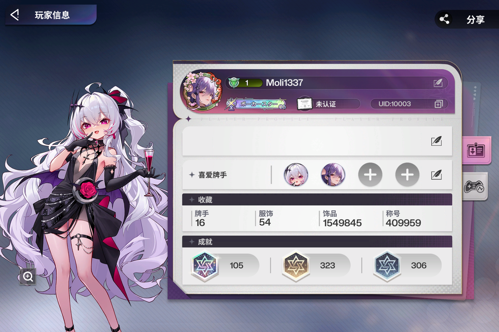
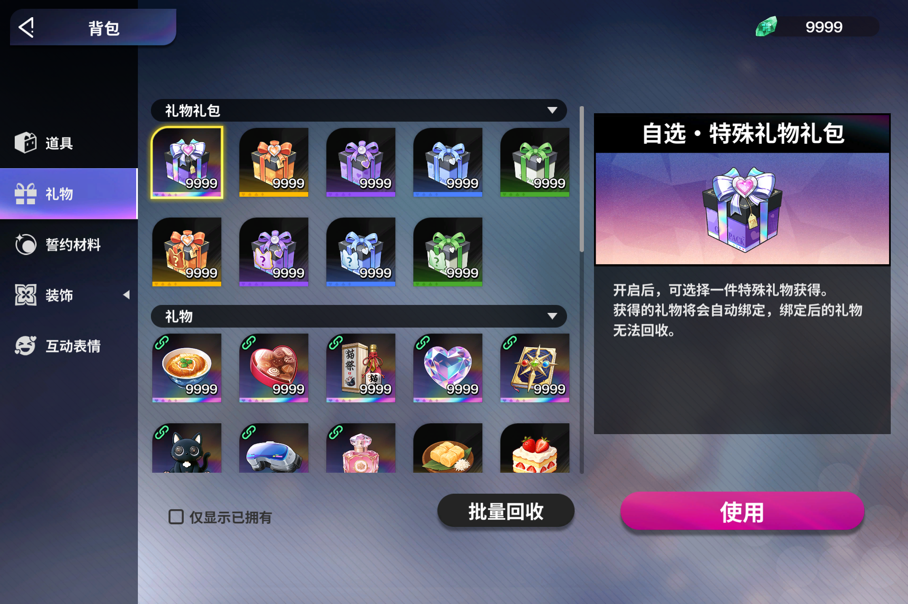

# Poker Fate Private Server - Release

## Packages

| # | Package | Description | Target User |
|---|---------|-------------|-------------|
| 1 | `patcher_source.zip` | Python patch scripts + XXTEA docs | Developers regenerating patches |
| 2 | `patched_files.zip` | Pre-patched client files (copy & play) | End users |
| 3 | `server_source.zip` | Go server source code | Developers building/modifying server |
| 4 | `server_binary.zip` | Compiled server binary + configs + migrations | End users running server |
| 5 | `5_client_full.zip` | Full sanitized game client (1.5 GB) | End users without the original game |

> **Package 5** is the complete Poker Fate client.

## Quick Start

### Server (packages 3 or 4)

1. Install PostgreSQL 17+ and Redis
2. Create database: `CREATE DATABASE pokerfate; CREATE USER poker WITH PASSWORD 'poker'; GRANT ALL ON DATABASE pokerfate TO poker;`
3. Run migrations: `psql -U poker -d pokerfate -f migrations/001_init.sql` (then 002-007)
4. If using binary (package 4): run `poker-fate-server.exe`
5. If using source (package 3): `go build -o poker-fate-server.exe ./cmd/server/ && ./poker-fate-server.exe`
6. Edit `configs/config.yaml` to change default credentials (database password, JWT secret, salts)

### Client (packages 1, 2, or 5)

1. **If you already have the original game installed**: use package 2 (pre-patched files) or package 1 (patcher source). Copy the 3 files to your game install (see paths below).
2. **If you don't have the original game**: use package 5 (full client, 1.5 GB). Extract and run — patches are already applied.

**File destinations:**
| Source | Destination |
|---|---|
| `steam_appid.txt` | `<game>/steam_appid.txt` |
| `settings.json` | `<game>/Poker Fate_Data/StreamingAssets/aa/settings.json` |
| `app_91421dd8f87b4ee559c3e3d77c2271f5.bundle` | `<game>/Poker Fate_Data/StreamingAssets/aa/StandaloneWindows64/LocalFiles/remote_res/gameres_assets_src/` |

3. Launch the game — it connects to `127.0.0.1:8888`

## Security Notice

- The `settings.json` patch disables Addressables catalog updates. This is required for the patched bundle to load.
- The `steam_appid.txt` uses `480` (Spacewar, Steam's public test app). No real Steam client is needed.

## Disclaimer

For educational and research purposes only.
